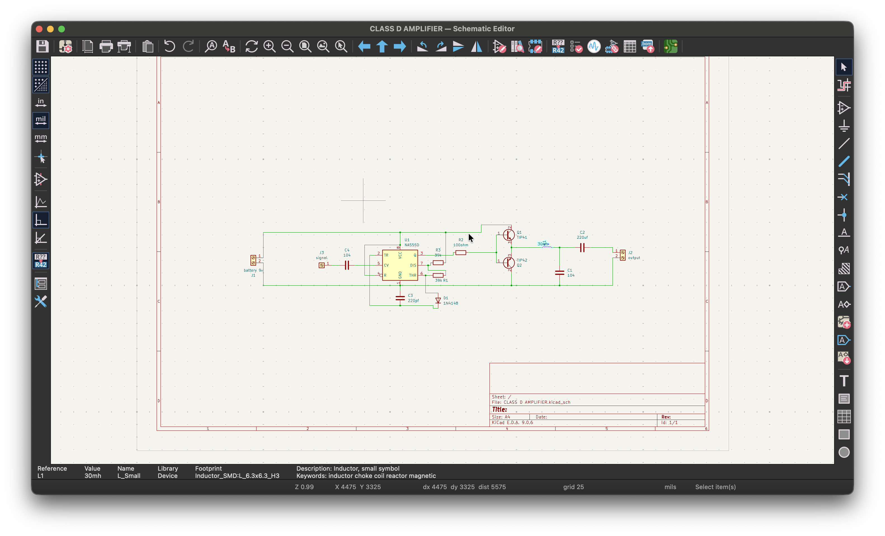
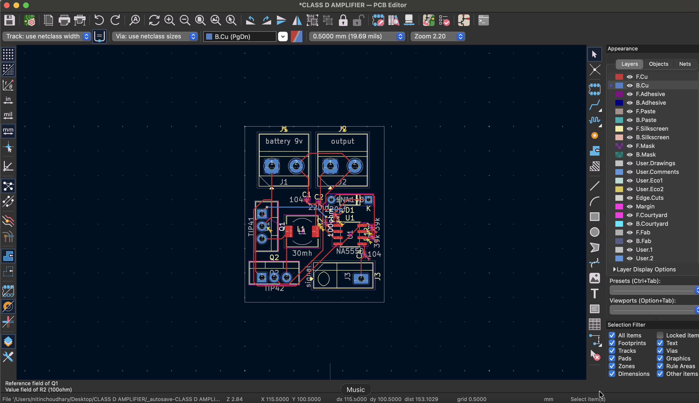

# CLASS-D-AMPLIFIER
Circuit and PCB Design on Kicad Software
# 555 Timer Class D Audio Amplifier

This repository contains the KiCad design files (Schematic and PCB layout) for a simple yet effective **Class D Audio Amplifier** based on the widespread **NE555 Timer IC**.

Unlike Class AB amplifiers which dissipate a lot of heat, this Class D design utilizes Pulse Width Modulation (PWM) to achieve higher efficiency, driving a push-pull output stage with TIP41 and TIP42 transistors.

## 📸 Project Visuals

### 3D Visualization

*A 3D rendering of the final PCB assembly showing component placement.*

### Schematic Diagram

*The circuit logic showing the 555 Timer configured as a PWM generator driving the output transistors.*

### PCB Layout

*The compact trace routing and footprint layout designed in KiCad.*

---

## 🚀 Features
* **High Efficiency:** Uses Class D topology (PWM modulation).
* **Simple Components:** Built around the common NE555 Timer and generic power transistors.
* **Compact Design:** Small form factor PCB suitable for portable audio projects.
* **Power Supply:** Designed for a standard 9V battery input.

## 🛠 Component List (BOM)
To build this project, you will need the following key components:

| Component | Value/Type | Description |
| :--- | :--- | :--- |
| **U1** | NE555 | Timer IC (DIP-8 or SMD) |
| **Q1** | TIP41 | NPN Power Transistor |
| **Q2** | TIP42 | PNP Power Transistor |
| **L1** | 30mH | Inductor (Output Filter) |
| **J1, J2, J3** | Screw Terminals | For Power, Output, and Signal |
| **C1, C2, etc.** | Various | Ceramic/Electrolytic Capacitors (see schematic) |
| **R1, R2, etc.** | Various | Resistors (see schematic) |

## ⚙️ How It Works
1.  **Input:** The analog audio signal enters via the `Signal` terminal.
2.  **Modulation:** The **NE555 Timer** is configured in an astable mode but modified so that the audio input modulates the pulse width of the output square wave (PWM).
3.  **Amplification:** The PWM signal drives the **TIP41** and **TIP42** transistors, which act as high-speed switches.
4.  **Filtering:** The output LC filter (Inductor L1 and capacitors) removes the high-frequency switching noise, leaving behind the amplified audio signal to drive the speaker.

## 📂 Repository Structure
* `*.kicad_pro` - Project file.
* `*.kicad_sch` - Schematic file.
* `*.kicad_pcb` - PCB Layout file.
* `/images` - Project screenshots and renders.

## 💻 Software Used
This project was designed using **KiCad**, an open-source electronics design automation suite.

## 📝 Author
**Atul Choudhary** [GitHub Profile](https://github.com/choudharyatul80911-beep)

---
*If you find this project useful, please give it a star! ⭐*
